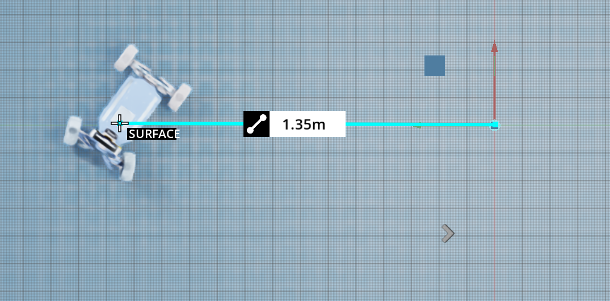
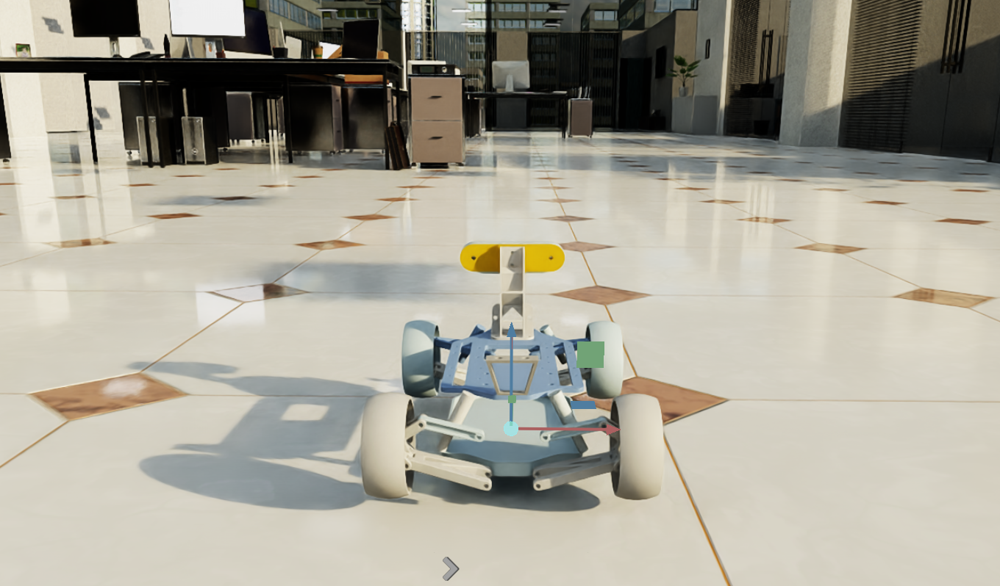
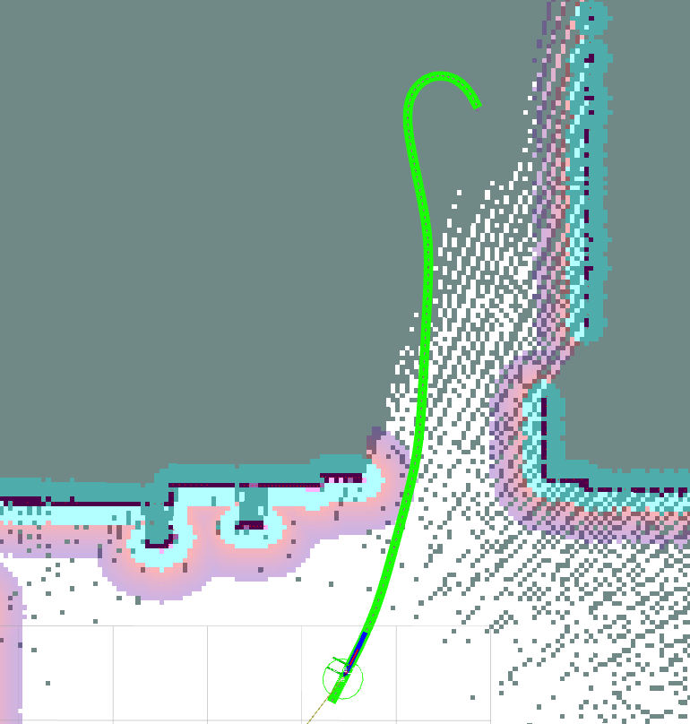

# 🚗 IsaacSim Ackermann 네비게이션 및 SLAM


**NVIDIA Isaac Sim 4.5에서 Ackermann 조향 차량을 위한 ROS 2 기반 네비게이션 및 SLAM 프레임워크**

---

## 📌 개요

- 이 프로젝트는 **NVIDIA Isaac Sim 4.5**에서 **Ackermann 조향 차량**을 위한 **통합된 네비게이션 및 SLAM 스택**을 제공합니다.

| Leather Radius | Leather + Office | Planner |
|---------|----------------|-------------|
|  |  |  |


**ROS 2 Navigation2**, **SmacPlannerHybrid** **nav2_regulated_pure_pursuit_controller**를 활용하여 다음과 같은 기능을 제공합니다:

- ✅ **Ackermann 운동학에 최적화된 Hybrid A 글로벌 플래너**
- ✅ **경로 곡률에 따라 조향과 속도를 동적으로 조절하는 로컬 플래너**  
- ✅ **Cartographer 및 SLAM-Toolbox 기반 SLAM 지원**  
- ✅ **NVIDIA Isaac Sim과의 원활한 통합**

이 패키지는 **Ackermann 차량의 현실적인 주행**을 가능하게 하며, 기존의 차동 구동 방식의 한계를 극복합니다.

**Waypoint의 orientation이 시작점 기준으로 크게 차이가 나면 수렴하지 못하는 한계가 존재**
---

## 📁 패키지 구조

### 🎮 제어 모듈

1. **Ackermann 텔레오퍼레이션 및 속도 변환**
    
    - `cmdvel_to_ackermann.launch.py`
        
        - 표준 **cmd_vel → AckermannDriveStamped** 변환 (Isaac Sim 튜토리얼과 동일)
            
    - `teleop_to_ackermann.launch.py`
        
        - **teleop_twist_keyboard**를 통한 직접 제어 지원
            

### 🗺️ SLAM (Simultaneous Localization and Mapping)

1. **Cartographer 기반 SLAM**
    
    - `cartographer.launch.py` (온라인 매핑 및 루프 클로저 지원)
        
2. **SLAM-Toolbox 기반 SLAM**
    
    - `slam_toolbox.launch.py` (지속적인 매핑 및 정적 매핑 모드 제공)
        

### 🚀 네비게이션

1. **로컬라이제이션 기반 네비게이션**
    
    - `localization.launch.py` (사전 생성된 맵 필요)
        
2. **SLAM & 네비게이션 통합 실행**
    
    - `bringup.launch.py`
        
        - `ackermann_params.yaml`
            

---

## 🛠️ 설치 방법

### **1️⃣ ROS 2 필수 패키지 설치**

```
sudo apt update && sudo apt install -y \
    ros-humble-navigation2 \
    ros-humble-nav2-bringup \
    ros-humble-cartographer \
    ros-humble-cartographer-ros \
    ros-humble-slam-toolbox \
    ros-humble-nav2-regulated-pure-pursuit-controller \
    ros-humble-nav2-smac-planner
```

### **2️⃣ 패키지 클론 및 빌드**

```
cd ~/ros2_ws/src
git clone https://github.com/lollolha97/isaacsim_ackermann.git
cd ~/ros2_ws
colcon build --symlink-install
source install/local_setup.bash
```

---

## ▶️ 실행 방법

### **1️⃣ 텔레오퍼레이션을 통한 수동 제어**

```
# cmd_vel을 Ackermann 명령으로 변환
ros2 launch cmdvel_to_ackermann cmdvel_to_ackermann.launch.py

# 텔레오퍼레이션 키보드 실행
ros2 run teleop_twist_keyboard teleop_twist_keyboard
```

### **2️⃣ SLAM 초기화**

```
# Cartographer SLAM 실행
ros2 launch ackermann_slam cartographer.launch.py

# SLAM-Toolbox 실행
ros2 launch ackermann_slam slam_toolbox.launch.py
```

### **3️⃣ SLAM & 네비게이션 실행**

```
ros2 launch ackermann_nav bringup.launch.py
```

---

## 🔧 주요 개선 사항 및 플래너 최적화

### ✅ **글로벌 플래너: SmacPlannerHybrid**

- __Hybrid A__ _알고리즘 적용_*
        
- **효율적인 경로 스무딩**, 급격한 방향 전환 최소화
    

### ✅ **로컬 플래너: nav2_regulated_pure_pursuit_controller**

- **경로 곡률에 따라 동적 속도 조절**
    
- **Ackermann 차량에 적합한 경로 추적 개선**
    
- **불필요한 후진 및 불안정한 회전 제거**
    

이러한 최적화를 통해 **Ackermann 차량의 부드럽고 현실적인 네비게이션**이 가능해지며, 기존 차동 구동 방식의 한계를 효과적으로 해결합니다.

---

## 🚀 현재 문제점 및 향후 개선 사항

🚀 네비게이션 성능 향상을 위한 현재 문제점 및 개선 계획:

- ✅ **목표 도착 시 원치 않는 원형 경로 생성 문제 해결 예정**
    
- ✅ **Ackermann 차량이 회전할 수 없으므로 Spin Recovery 동작 제거**
    
- ✅ **장애물 근처에서의 경로 불안정성 개선 필요**
    

---

## 🔗 참고 및 외부 저장소

- 📌 **NVIDIA IsaacSim ROS Workspaces**: [IsaacSim-ros_workspaces](https://github.com/isaac-sim/IsaacSim-ros_workspaces)
    
- 📌 **NeuronBot2 (기반 프레임워크)**: [NeuronBot2](https://github.com/Adlink-ROS/neuronbot2)
    
- 📌 **ROS 2 Navigation2**: [Navigation2](https://github.com/ros-planning/navigation2)
    
- 📌 *_Smac Planner (Hybrid A_)**: [SmacPlannerHybrid](https://github.com/ros-planning/navigation2/tree/main/nav2_smac_planner)
    
- 📌 **Regulated Pure Pursuit Controller**: [nav2_regulated_pure_pursuit_controller](https://github.com/ros-planning/navigation2/tree/main/nav2_regulated_pure_pursuit_controller)
    